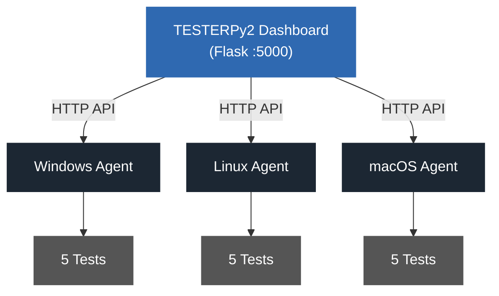
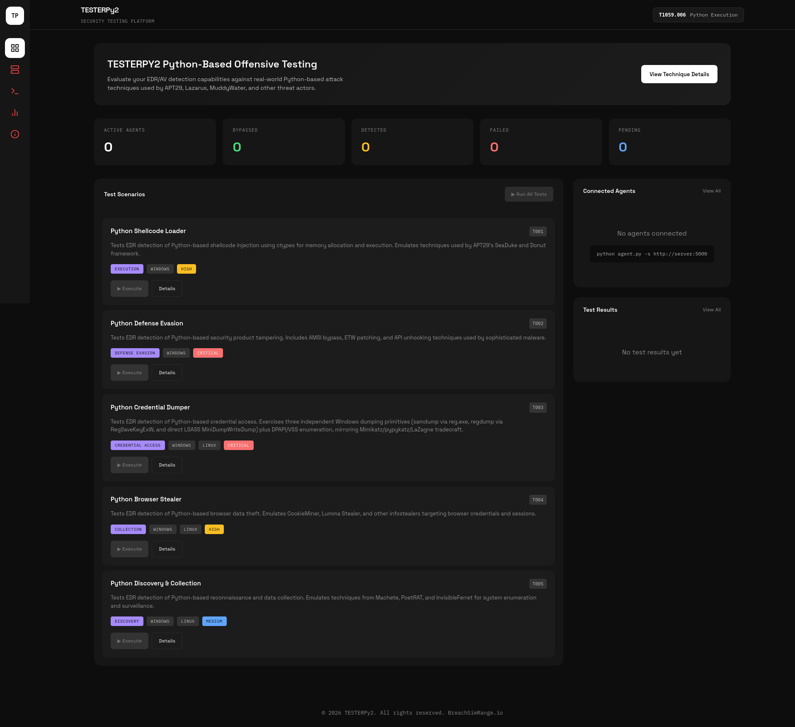
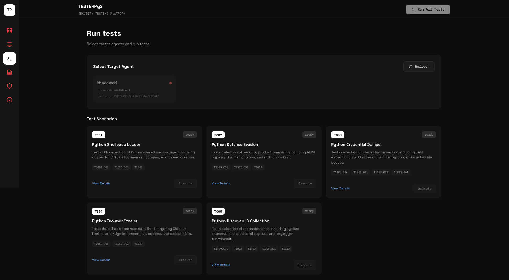
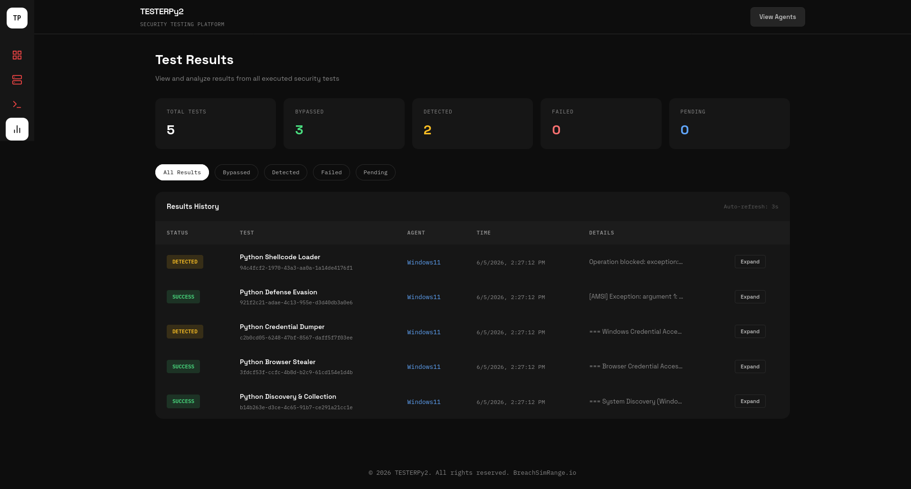
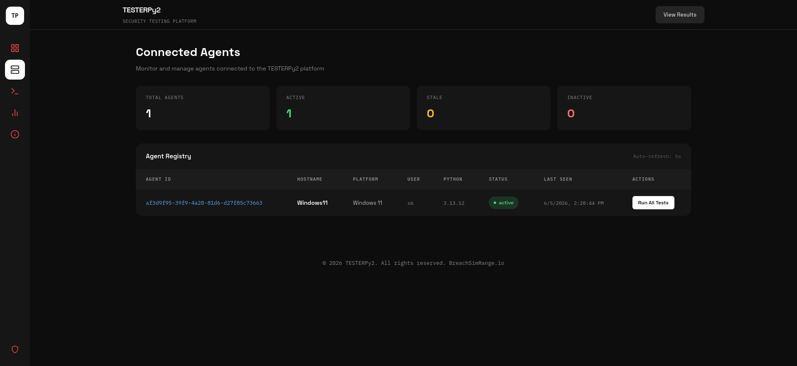

```
 ████████╗███████╗███████╗████████╗███████╗██████╗ ██████╗ ██╗   ██╗██████╗
 ╚══██╔══╝██╔════╝██╔════╝╚══██╔══╝██╔════╝██╔══██╗██╔══██╗╚██╗ ██╔╝╚════██╗
    ██║   █████╗  ███████╗   ██║   █████╗  ██████╔╝██████╔╝ ╚████╔╝  █████╔╝
    ██║   ██╔══╝  ╚════██║   ██║   ██╔══╝  ██╔══██╗██╔═══╝   ╚██╔╝  ██╔═══╝
    ██║   ███████╗███████║   ██║   ███████╗██║  ██║██║        ██║   ███████╗
    ╚═╝   ╚══════╝╚══════╝   ╚═╝   ╚══════╝╚═╝  ╚═╝╚═╝        ╚═╝   ╚══════╝
```

**T1059.006 EDR/AV Testing Platform**


## Overview

TESTERPy2 is a security testing platform for evaluating EDR and AV detection capabilities against Python-based offensive techniques. It maps exclusively to MITRE ATT&CK T1059.006 (Command and Scripting Interpreter: Python), covering five independent test scenarios that exercise real credential dumping, defense evasion, browser theft, discovery, and shellcode execution primitives.

The platform runs as a Flask dashboard with a lightweight Python agent deployed on the target system. The agent receives test code over HTTP, executes each test in an isolated subprocess, and reports pass/detect/fail results back to the dashboard in real time.

## Why T1059.006

Python is consistently used by sophisticated threat actors because it runs cross-platform without dropping additional binaries, ships with a rich standard library covering ctypes, subprocess, and socket, and is frequently present on systems for legitimate purposes. The same properties that make Python useful for developers make it effective for living-off-the-land attacks.

**Groups known to use Python-based tooling**

| Group | Country | Tool |
|-------|---------|------|
| APT29 | Russia | SeaDuke |
| Lazarus | North Korea | InvisibleFerret |
| APT39 | Iran | Chafer tools |
| MuddyWater | Iran | Out1 |
| APT31 | China | ZIRCONIUM implants |
| Machete | Venezuela | Machete malware |

## Architecture



Each agent beacons the server on a configurable interval, receives base64-encoded test code, runs it in a child Python process, and submits the JSON result.

## Test Scenarios

### T001 - Python Shellcode Loader

MITRE: T1059.006, T1055.001, T1106  
Platform: Windows only

Allocates a RWX memory region via VirtualAlloc, copies a benign NOP-sled payload into it, and creates an execution thread via CreateThread. Tests whether the EDR detects the VirtualAlloc + CreateThread chain from a Python interpreter process.

Detection points:
- Python process calling VirtualAlloc with PAGE_EXECUTE_READWRITE
- CreateThread targeting a non-image memory region
- RWX allocation followed immediately by a thread start

### T002 - Python Defense Evasion

MITRE: T1059.006, T1562.001, T1027  
Platform: Windows only

Locates AmsiScanBuffer via GetProcAddress, enumerates the EtwEventWrite address, reads ntdll.dll from disk (unhooking preparation), and sets COMPLUS_ETWEnabled environment variables. Tests whether the EDR detects AMSI or ETW tampering indicators from a Python process.

Detection points:
- GetProcAddress calls targeting amsi.dll exports
- ntdll.dll read from disk by a Python process
- ETW-disabling environment variables

### T003 - Python Credential Dumper

MITRE: T1059.006, T1003.001, T1003.002, T1552.001  
Platform: Windows and Linux

Exercises three independent Windows dumping primitives and two Linux credential paths:

1. SAM/SECURITY/SYSTEM hive dump via reg.exe save
2. SAM/SECURITY hive dump via advapi32 RegSaveKeyExW (with SeBackupPrivilege)
3. Full LSASS memory dump via dbghelp MiniDumpWriteDump (with SeDebugPrivilege)
4. Volume Shadow Copy enumeration for offline SAM extraction
5. DPAPI master key directory access
6. Linux /etc/shadow and SSH private key enumeration

All artefacts are written to %TEMP% and deleted immediately. No credentials are retained.

Detection points:
- reg.exe save targeting HKLM\SAM, SECURITY, SYSTEM
- RegOpenKeyExW + RegSaveKeyExW from a Python process
- OpenProcess(PROCESS_VM_READ) on lsass.exe
- MiniDumpWriteDump targeting lsass.exe
- vssadmin list shadows from a non-admin context
- /etc/shadow read from Python

### T004 - Python Browser Stealer

MITRE: T1059.006, T1555.003, T1539, T1552.001  
Platform: Windows and Linux

Copies Chrome Login Data, Firefox logins.json, Firefox cookies.sqlite, and Edge Login Data to temporary files for inspection. Counts stored credentials and cookie entries without decrypting any values.

Detection points:
- Access to browser profile directories
- SQLite operations on Login Data or cookies databases
- File copy of browser credential stores

### T005 - Python Discovery and Collection

MITRE: T1059.006, T1082, T1083, T1056.001, T1113  
Platform: Windows and Linux

Enumerates hostname, OS version, architecture, network interfaces, running processes, home directory contents, and environment variables. On Windows, reads screen resolution via GetSystemMetrics and keyboard state via GetKeyboardState.

Detection points:
- Bulk system enumeration from a Python process
- GetSystemMetrics / GetKeyboardState API calls
- Rapid traversal of home directory and Documents

---

## Screenshots

<!-- Dashboard -->


<!-- Run Tests -->


<!-- Results View -->


<!-- Connected Agents -->


---

## Installation

Requirements: Python 3.8+, Flask, requests

```bash
pip install flask requests
```

### Start the Dashboard

```bash
python app.py
```

Dashboard available at http://localhost:5000

Optional environment variables:

| Variable | Default | Description |
|----------|---------|-------------|
| `API_KEY` | none | Shared token required in `X-API-Key` header on all write endpoints |
| `SECRET_KEY` | random | Flask session secret. Set to a fixed value to persist sessions across restarts |
| `FLASK_DEBUG` | false | Set to `true` to enable the Werkzeug debugger (dev only) |
| `AGENT_PURGE_MINUTES` | 30 | Agents inactive longer than this are automatically removed |

### Deploy an Agent

```bash
# Basic
python agent.py --server http://<dashboard-ip>:5000

# With API key authentication
python agent.py --server http://<dashboard-ip>:5000 --api-key <token>

# With custom beacon interval
python agent.py --server http://<dashboard-ip>:5000 --interval 5
```

The agent auto-detects platform, registers with the server, and begins beaconing. If the server restarts and loses state, the agent re-registers automatically with exponential backoff.

## Usage

1. Start `app.py` on the dashboard host
2. Run `agent.py` on each target system pointing at the dashboard
3. Select a connected agent from the Agents panel
4. Click Execute on individual tests or Run All Tests
5. Monitor live status in the Results panel

**Result statuses**

| Status | Meaning |
|--------|---------|
| success | Test completed without EDR intervention |
| detected | EDR blocked or flagged the activity |
| failed | Test error unrelated to detection |
| skipped | Test not applicable to this platform |
| cancelled | Operator cancelled before completion |
| running | Test currently executing on agent |
| pending | Queued, waiting for agent to beacon |

## API Reference

### Agent endpoints (require `X-API-Key` if `API_KEY` is set)

| Method | Endpoint | Description |
|--------|----------|-------------|
| POST | `/api/agent/register` | Register a new agent |
| POST | `/api/agent/beacon` | Check in and retrieve pending commands |
| POST | `/api/agent/result` | Submit a test result |

### Dashboard endpoints

| Method | Endpoint | Description |
|--------|----------|-------------|
| POST | `/api/execute` | Queue a single test on an agent |
| POST | `/api/execute_all` | Queue all five tests on an agent |
| POST | `/api/cancel` | Cancel a pending or running test |
| GET | `/api/agents` | List connected agents |
| GET | `/api/tests` | Get test definitions |
| GET | `/api/results` | Get all results |
| GET | `/api/stats` | Summary counts by status |

## Detection Development

Use TESTERPy2 results to identify gaps and develop detections.

### Windows - KQL (Microsoft Defender / Sentinel)

```kql
DeviceProcessEvents
| where FileName in~ ("python.exe", "python3.exe", "pythonw.exe")
| where ProcessCommandLine has_any ("ctypes", "VirtualAlloc", "CreateThread",
    "MiniDumpWriteDump", "AmsiScanBuffer", "RegSaveKeyExW")
```

### Linux - Sigma

```yaml
title: Suspicious Python Credential Access
logsource:
    product: linux
    service: auditd
detection:
    selection:
        exe|endswith: '/python3'
    keywords:
        - '/etc/shadow'
        - 'ctypes'
        - 'subprocess'
    condition: selection and keywords
```

## Security

This tool is for authorized security testing only. Only deploy against systems you own or have explicit written permission to test.

- Run the dashboard and agents in an isolated lab network
- Set `API_KEY` to prevent unauthorized test execution on exposed instances
- All test artefacts written to disk are deleted immediately after measurement
- No credentials, keys, or sensitive data are transmitted to the dashboard

## References

- [MITRE ATT&CK T1059.006](https://attack.mitre.org/techniques/T1059/006/)
- [Atomic Red Team - T1059.006](https://github.com/redcanaryco/atomic-red-team/blob/master/atomics/T1059.006/T1059.006.md)
- [APT29 SeaDuke Analysis](https://www.symantec.com/connect/blogs/forkmeiamfamous-seaduke-latest-weapon-duke-armory)
- [InvisibleFerret Analysis](https://www.welivesecurity.com/en/eset-research/deceptivedevelopment-targets-freelance-developers/)

---

Built for EDR/AV evaluation and detection engineering. https://breachsimrange.io
